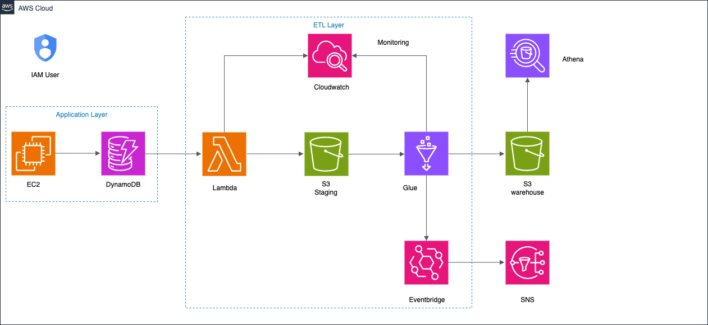

# AWS Student Data Pipeline (Real-Time + Batch ETL)

An end-to-end serverless data pipeline that collects, stores, transforms, and analyzes student academic data using AWS services like EC2, DynamoDB, Lambda, S3, Glue, and Athena.

## 📌 Screenshot

## 🔧 Project Overview

This project demonstrates how to build a scalable real-time + batch data processing system on AWS for managing student records.

- 🧾 Frontend form to collect student marks
- 🧠 Backend API with Flask hosted on EC2
- 🔄 DynamoDB Streams triggering Lambda
- 📥 Lambda loads raw records to S3
- ⚙️ AWS Glue joins and transforms data
- 📊 Data stored in S3 (Parquet) and queried via Athena

## 🔗 AWS Services Used

| Service        | Purpose                                      |
|----------------|----------------------------------------------|
| **EC2**        | Host the Flask application                   |
| **DynamoDB**   | Store real-time student & marks data         |
| **Lambda**     | Trigger on DynamoDB Stream → Save to S3      |
| **S3**         | Store raw CSVs and final Parquet files       |
| **Glue**       | Join, transform, and write to data warehouse |
| **Athena**     | Query final data using SQL                   |
| **EventBridge**| Trigger SNS alerts on Glue job completion    |
| **SNS**        | Email notification after ETL success/failure |

## 📌 Features

- Real-time data ingestion from a web app
- Batch processing using AWS Glue
- Schema merge and union handling
- Parquet compression for performance
- Scalable and serverless architecture
- Athena dashboard-ready

## 🧪 Sample Use Case

> A school admin enters student marks through a web form.  
> The data is instantly written to DynamoDB and backed up to S3.  
> Later, a Glue job processes all data and prepares a warehouse layer for querying with Athena or BI tools.

## 📈 Output

- **Raw Data:** `s3://bb-de-project-2/staging/student/`, `marks/`
- **Warehouse:** `s3://bb-de-project-2/datawarehouse/` (Parquet files)
- **Athena Table:** Points to warehouse folder with ready-to-query schema

## 🧰 Setup Instructions

1. **Launch EC2 Instance**  
   - Host Flask app with `run.py`
   - Use Gunicorn + Nginx for production

2. **Deploy DynamoDB Tables**  
   - `student` (id)  
   - `marks` (student_id + class)

3. **Create Lambda Trigger**  
   - Source: DynamoDB Stream  
   - Target: S3 → staging/ folder  
   - Include `pandas` in Lambda Layer

4. **Upload Glue Job**  
   - Use `glue_etl_job.py`  
   - Configure source S3 folders & output path

5. **Set up Athena**  
   - Use Glue Crawler or manual schema  
   - Query `datawarehouse/` folder

6. **Set up SNS Alerts**  
   - Use EventBridge → Glue Job Status  
   - Notify success/failure via email

## ✅ Tech Stack

- Python, Flask
- AWS EC2, Lambda, S3, Glue, DynamoDB, Athena
- Pandas, Boto3, PySpark
- Gunicorn + Nginx
- HTML, CSS (Bootstrap)

## 📬 Contact

**Author:** Bharadwaj Bairi  
**Email:** bharadwajbairi3@gmail.com  
**LinkedIn:** [linkedin.com/in/bharadwajbairi](https://linkedin.com/in/bharadwajbairi)

## 🏁 Status

✅ Completed and deployed.  
🎯 Future Enhancements: Quicksight dashboards, CI/CD for Lambda + Glue jobs.

